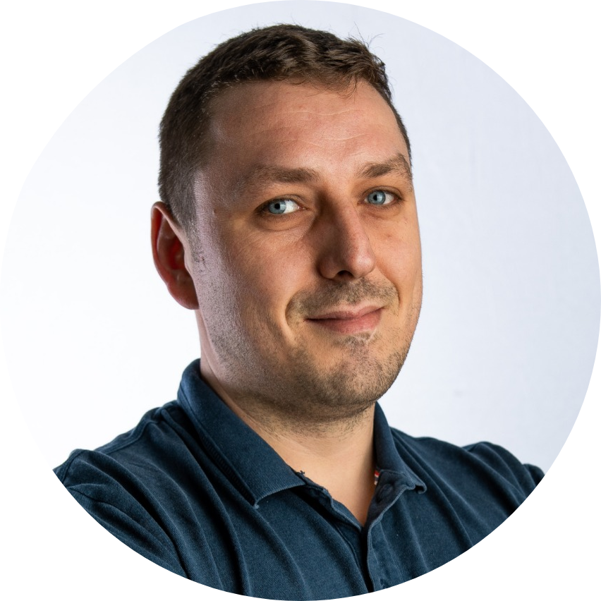

     
# Cosmin Croitoriu
cosmin.c.croitoriu@gmail.com

## Brief Itroduction

A full-stack junior developer, fresh Makers graduate, analitycally minded and with a massive interest for technology.  

## Projects
 - [Woke App](https://github.com/mondongos/woke-platypus) - By team PLatypus Boys
  Woke app is an Android application develloped in Java and Android Studio that implements Text to Speech and Speech to Text.
  The idea of the project is to create a quiz app that can be used hands free while driving and to be used only with voice commands.
  For Text to Speech implementation my team and I took advantage of the in-build Android Studio TTS
  For Speech to Text functionality we included DialogueFlow with the help of API. The project has been done using Java and JUnit as testing framework.
   
 - [Makers-BnB](https://github.com/Cosmin-Croitoriu/Makers-Bnb) - By Team Alpha
   Makers-Bnb is a web application in which various users create an account, can view a list of avaliable properties for renting, list their properties for a specific period of time, as well as accept or reject requests from other users. 
   Developed in Ruby and Sinatra, including Postgresql for database, DataMapper as ORM,    Rspec and Capybara as testing frameworks, HTML and CSS for frontend. The server has been remotely hosted on Heroku. 
 
 - [Acebook](https://github.com/marbuthnott/acebook-d-railed) - By team D-railed
     Acebook Web app alowes users to sign up and sign in, submit posts on their Wall Page or on other's users; like or dislike various posts; delete or update the posts they created in .
   Group project as a Facebook clone, developed in Ruby on Rails, with the help of Activerecord, HTML, CSS, Travis CI, RSpec, Capybara 

## Skills

#### Fast learner
Makers helped me discover a new power - quick learning abilities - learn new concepts and apply them to a range of different problems that serve various purposes.

#### Adaptable
I am not afraid to try new things, experiement and learn from experiences to improve. As a bank staff for NHS I used to work different roles all the time and I enjoyed being part of different teams and learn how they work and how they connect to other services.

#### Teamwork
I love being part of a team, share my ideas and learn from others.

#### 

## Education

#### Makers (April 2019 to July 2019)

- Intensive coding bootcamp.
- Fast pased.
- Elaborate introduction into coding, promoting  Agile Development and TDD aproaches to  sowftare engineering.
- Full stack development and projects.
- Values: Agile/XP.
- Languages: Ruby, JavaScript, Java, HTML/CSS
- Testing: RSpec, Jasmine, Capybara.
- Web Frameworks: Sinatra, 
- Databases: PostgreSQL.

#### Barking and Dagenham College (September 2017 to April 2019)
- Lev 3 Diploma in menchanical engineering: Domesting plumbing and Heating

#### Alexandru Ioan Cuza University (September 2004 to April 2008)
- Linguistics Degree in Romanian and Italian language

## Experience
- 4 Exciting months into coding trough Makers
- 8 Years experience as a mechanical engineer (domesting and commercial heating industry) 
